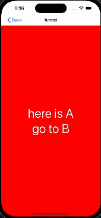

# react-native-pure-funnel

easy handling funnel in react native.

This library was inspired by Toss's useFunnel and is designed for use in React Native.

ref. [toss slash useFunnel](https://www.slash.page/ko/libraries/react/use-funnel/README.i18n), [useFunnel youtube](https://www.youtube.com/watch?v=NwLWX2RNVcw)



## Installation

```sh
npm install @pureboard/react-native-pure-funnel
yarn add @pureboard/react-native-pure-funnel
```

## Usage

how to use `react-native-pure-funnel`
1. Wrap the component where you want to apply the funnel with the `withFunnel` HOC.
2. Place `FunnelStep` components within the `Funnel` component to set up the desired funnel.
3. Import useFunnel and initialize it by passing steps and options (optional) as parameters.
4. You can handle funnel transitions using `funnelNavigation`.
5. Configure the Android back button and the react-navigation header appropriately (using funnelNavigation.goBack).
6. Each funnel step has the default dimensions of the `viewport’s screenWidth and screenHeight`. If you're using react-navigation's stack navigator, pass the `headerHeight` to the Funnel as `extraHeight` prop.
7. For more details, refer to the usage code below or the example app in the repository.

```js
import {
  Funnel,
  FunnelStep,
  withFunnel,
  useFunnel
} from '@pureboard/react-native-pure-funnel';
import {
  useNavigation,
} from '@react-navigation/native';
import { useHeaderHeight } from '@react-navigation/elements';

const steps = ['A', 'B', 'C'] as const;

// you must wrap your component with `withFunnel` HOC
export const FunnelScreen = withFunnel(() => {
  const navigation = useNavigation();
  const headerHeight = useHeaderHeight();

  const { funnelNavigation } = useFunnel<typeof steps>(steps, {
    goBackAction: navigation.goBack,
  });

  return (
    <Funnel<typeof steps> extraHeight={headerHeight}>
      <FunnelStep name={'A'}>
        {/* A funnel content*/}
        <View>
           <Button label={'go to B funnel} onPress={()=>funnelNavigation.goForward()}/>
        </View>
      </FunnelStep>
      <FunnelStep name={'B'}>
        {/* B funnel content*/}
      </FunnelStep>
      <FunnelStep name={'C'}>
        {/* C funnel content*/}
      </FunnelStep>
    </Funnel>
  );
});
```

## types
### FunnelOptions
`initialStep(ArrayElement<Steps>)`: The step or steps to start the funnel from.
`goBackAction(()=>void)`: This is executed when the length of the funnelStack is 1 or less, and no more funnels can be popped.

### FunnelNavigationOptions
`animated(boolean)`: Whether the transition should be animated

## API Reference

###  useFunnel
Initializes the funnel with the specified steps. and returns funnel handling interfaces.
(The Funnel is not rendered on the screen until the initialization code is called.)
### params
`steps(Steps)`: An array of steps that represent the funnel stages.
`options(optional)`?: FunnelOptions

### returns

#### funnelSteps: `(Steps | null)`
The list of funnel steps.

#### funnelStack: `ArrayElement<Steps>[] | null`
The current stack of visited funnel steps.

#### funnelOptions: `FunnelOptions<ArrayElement<Steps>>`
The current funnel options.

#### funnelNavigation
The funnelNavigation object contains methods for controlling the funnel navigation flow:

- goBack
`(navigateOptions?: FunnelNavigationOptions)=>void`: Navigate back to the previous step.

- goForward
`(navigateOptions?: FunnelNavigationOptions)=>`: Move to the next step.

- reset
`(stack?: Steps[], navigateOptions?: FunnelNavigationOptions)=>void`: You can customize the funnelStack to the desired form. If no stack is passed, it will reset to the default initial value.

- navigate
`(step: Step, navigateOptions?: FunnelNavigationOptions)=>void`: Navigate to a specific step.

- replace
`(step: Step, navigateOptions?: FunnelNavigationOptions)`: Replace the current step with a new one.

- setOptions   `(options: Partial<FunnelOptions<Steps>>)`: Update funnel options dynamically.

## Funnel Component
The Funnel component is used to manage step-based navigation flows, allowing users to navigate through predefined steps in a funnel. This component provides additional configuration options for handling gestures and screen dimensions, particularly on iOS devices.

### gestureEnabled (iOS only)
`Type`: boolean
`Default`: true
`Description`: Determines whether it's possible to trigger funnel back navigation using swipe gestures. This is an iOS-only feature.
`Usage`: When set to true, users can swipe to go back within the funnel if a previous step exists. If set to false, swipe gestures will be disabled.

### extraHeight
`Type`: number
`Default`: 0
`Description`: Specifies additional height to be added to the funnel’s viewport. This can be useful when using react-navigation's stack navigator because each funnel step has the default dimensions of the `viewport’s screenWidth and screenHeight. you can pass headerHeight to extraHeight.


## Contributing

See the [contributing guide](CONTRIBUTING.md) to learn how to contribute to the repository and the development workflow.

## License

MIT

---

Made with [create-react-native-library](https://github.com/callstack/react-native-builder-bob)
